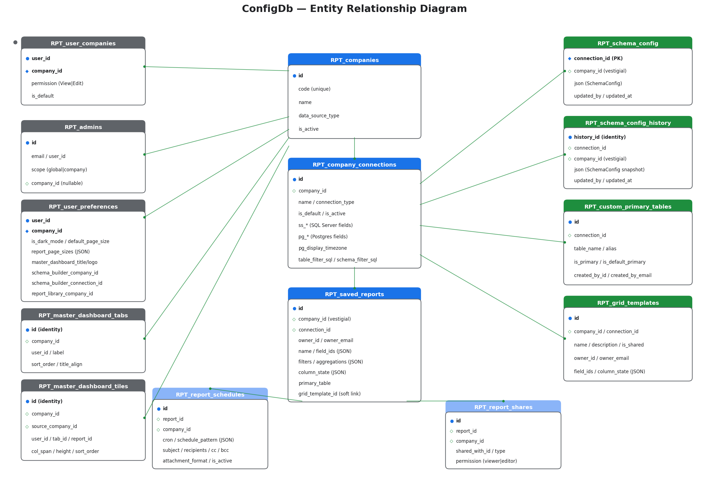

# Contents

- [Scope](#scope)
- [Entity-relationship diagram](#entity-relationship-diagram)
- [Company and connection registry](#company-and-connection-registry)
- [Admins and user access](#admins-and-user-access)
- [Reports and sharing](#reports-and-sharing)
- [User preferences and master dashboard](#user-preferences-and-master-dashboard)
- [Schema catalog](#schema-catalog)
- [Cascade rules](#cascade-rules)
- [Indexes at a glance](#indexes-at-a-glance)
- [Design notes](#design-notes)
- [Migrations](#migrations)

\newpage

# Scope

This document covers the **ConfigDb** — the application's own SQL Server database. ConfigDb holds reports, schemas, users, preferences, schedules, and dashboards; it is not the data your reports query against. All tables live under the `EMPOWER` schema.

The tenant-side **per-connection data sources** (SQL Server or Postgres databases each report queries) are **out of scope** — those are external, configured by admins through the connection editor UI, and their schemas vary by tenant.

**Identity model.** Users are identified by their Microsoft Entra `oid` (object ID, a GUID stored as a string). There is no users table. Every user-scoped row carries the `oid` directly in an `NVARCHAR(128)` column typically named `owner_id`, `user_id`, or `shared_with_id`. Email columns (`owner_email`) exist solely for display — never gate auth on them.

\newpage

# Entity-relationship diagram



Key: ● = primary key, ◇ = foreign key, ◆ = both. Green lines are FK relationships. Color-coded headers: dark blue (core), gray (user/identity), green (schema/catalog), light blue (report children).

\newpage

# Company and connection registry

## `RPT_companies`

Registry of companies (tenants) served by the app.

| Column | Type | Notes |
|---|---|---|
| `id` | UNIQUEIDENTIFIER PK | `NEWSEQUENTIALID()` default. TLE seed row pinned to `00000000-0000-0000-0000-000000000001` for legacy row compatibility. |
| `code` | NVARCHAR(32) UNIQUE | URL segment (e.g. `tle`). |
| `name` | NVARCHAR(200) | Display name. |
| `data_source_type` | NVARCHAR(20) | `sqlserver` / `postgres`. Legacy hint; authoritative type lives on `RPT_company_connections`. |
| `connection_ref` | NVARCHAR(100) | Legacy appsettings key; superseded by `RPT_company_connections`. |
| `is_active`, `created_at`, `updated_at` | | |

## `RPT_company_connections`

One or more DB connections per company. Each report binds to exactly one.

| Column | Type | Notes |
|---|---|---|
| `id` | UNIQUEIDENTIFIER PK | |
| `company_id` | UNIQUEIDENTIFIER FK → `RPT_companies.id` (CASCADE DELETE) | |
| `name` | NVARCHAR(100) | Unique per company (`UX_company_connections_name`). |
| `connection_type` | NVARCHAR(20) CHECK | `sqlserver` or `postgres`. Drives which `ss_*` / `pg_*` columns matter. |
| `is_default` | BIT | Filtered unique — at most one per company (`UX_company_connections_default`). |
| `is_active` | BIT | |
| `ss_data_source` | NVARCHAR(500) | SQL Server host. |
| `ss_initial_catalog` | NVARCHAR(200) | SQL Server database name. |
| `ss_integrated_security` | BIT | |
| `ss_user_id`, `ss_password` | NVARCHAR | SQL Server auth. Password plaintext (security TODO). |
| `ss_application_intent` | NVARCHAR(20) | `ReadOnly` / `ReadWrite` / NULL. |
| `ss_encrypt`, `ss_trust_server_certificate` | BIT | |
| `ss_mars` | BIT | MultipleActiveResultSets. |
| `pg_host` | NVARCHAR(255) | Postgres host. |
| `pg_port` | INT | |
| `pg_database`, `pg_username`, `pg_password` | NVARCHAR | Password plaintext (security TODO). |
| `pg_ssl_mode` | NVARCHAR(20) | `Disable` / `Prefer` / `Require` / `VerifyCA` / `VerifyFull`. |
| `pg_command_timeout`, `pg_timeout` | INT | |
| `pg_root_certificate`, `pg_ssl_certificate`, `pg_ssl_key` | VARBINARY(MAX) | PEM bytes. Key plaintext (security TODO). |
| `pg_display_timezone` | NVARCHAR(100) NULL | IANA zone (e.g. `US/Pacific`). When set, date/datetime fields flagged `ApplyTimezoneConversion` are wrapped `AT TIME ZONE 'GMT' AT TIME ZONE '<tz>'` at emission. |
| `table_filter_sql` | NVARCHAR(MAX) NULL | Admin WHERE-fragment for the Schema Builder table browser. |
| `schema_filter_sql` | NVARCHAR(MAX) NULL | Admin schema-level WHERE-fragment. |
| `created_at`, `updated_at` | | |

**CHECK constraints** enforce presence of the appropriate columns for the chosen `connection_type` (SQL Server requires host + catalog; Postgres requires host + database + username).

**Security TODO.** `ss_password`, `pg_password`, `pg_ssl_key` are plaintext. Encrypt before any non-TLE tenant goes to production (Always Encrypted, Key Vault, or app-level AES-GCM).

## `RPT_custom_primary_tables`

Per-connection curated list of root tables and aliases. Feeds the Report Builder's Primary Table picker and the Schema Builder's Source Table / Alias dropdowns.

| Column | Type | Notes |
|---|---|---|
| `id` | UNIQUEIDENTIFIER PK | |
| `connection_id` | UNIQUEIDENTIFIER FK → `RPT_company_connections.id` (CASCADE) | |
| `table_name` | NVARCHAR(200) | e.g. `salesforce.lead`. |
| `alias` | NVARCHAR(60) DEFAULT '' | Optional. Empty = no alias. |
| `is_primary` | BIT DEFAULT 0 | Eligible as a report primary (surfaces in "Suggested primaries"). |
| `is_default_primary` | BIT DEFAULT 0 | Pre-selected for new reports. Filtered unique — at most one per connection. |
| `created_at`, `created_by_id`, `created_by_email` | | |

Indexes:

- `UX_custom_primary_tables_unique (connection_id, table_name, alias)`
- `UX_custom_primary_tables_one_default (connection_id) WHERE is_default_primary = 1`

\newpage

# Admins and user access

## `RPT_admins`

Admin assignments. `global` scope bypasses per-company gates; `company` scope is admin only for the referenced company.

| Column | Type | Notes |
|---|---|---|
| `id` | UNIQUEIDENTIFIER PK | |
| `email` | NVARCHAR(256) | Entra email (lookup key). |
| `user_id` | NVARCHAR(128) NULL | Entra `oid`, filled on first sign-in. |
| `scope` | NVARCHAR(20) CHECK | `global` or `company`. |
| `company_id` | UNIQUEIDENTIFIER FK → `RPT_companies.id` (CASCADE) | NULL iff `scope='global'` (CHECK constraint). |
| `created_at`, `created_by` | | |

Filtered unique indexes: one global row per email (`UX_admins_global`); one company row per (email, company_id) (`UX_admins_company`).

## `RPT_user_companies`

User ↔ company access with per-company permission.

| Column | Type | Notes |
|---|---|---|
| `user_id` (PK) | NVARCHAR(128) | Entra `oid`. |
| `company_id` (PK) | UNIQUEIDENTIFIER FK → `RPT_companies.id` (CASCADE) | |
| `permission` | NVARCHAR(10) CHECK | `View` or `Edit`. |
| `is_default` | BIT | Filtered unique — at most one per user (`UX_user_companies_default`). |
| `created_at` | | |

\newpage

# Reports and sharing

## `RPT_saved_reports`

The core report-definition table.

| Column | Type | Notes |
|---|---|---|
| `id` | UNIQUEIDENTIFIER PK | |
| `company_id` | UNIQUEIDENTIFIER FK → `RPT_companies.id` | **Vestigial** — authoritative company is derived via `connection_id → company_connections.company_id`. Kept for legacy compatibility. |
| `name` | NVARCHAR(250) | |
| `owner_id` | NVARCHAR(128) | Entra `oid`. The identity key. Every `UPDATE` / `DELETE` has `WHERE id = @id AND owner_id = @userId`. |
| `owner_email` | NVARCHAR(256) | Display cache. |
| `field_ids` | NVARCHAR(MAX) | JSON array, e.g. `["loan_number","loan_amount"]`. |
| `filters` | NVARCHAR(MAX) NULL | JSON object. Multi-select filters are arrays; date ranges use `<field>_start` / `<field>_end` keys. |
| `aggregations` | NVARCHAR(MAX) NULL | JSON: `{field_id: "SUM"|"AVG"|…}`. |
| `column_state` | NVARCHAR(MAX) NULL | JSON: dashboard + detail-view config. |
| `grid_template_id` | UNIQUEIDENTIFIER NULL | Soft link to `RPT_grid_templates` (no FK — template delete doesn't cascade). |
| `connection_id` | UNIQUEIDENTIFIER FK → `RPT_company_connections.id` | Immutable after first save (enforced in UI). |
| `primary_table` | NVARCHAR(200) NULL | The `schema.table [AS alias]` root used in FROM. |
| `last_run_at`, `created_at`, `updated_at` | | |

Indexes: `IX_saved_reports_owner_id`, `IX_saved_reports_company_owner (company_id, owner_id)`, `IX_saved_reports_connection`.

### `column_state` JSON shape (reference)

```json
{
  "GroupByFieldId": "loan_officer",
  "MeasureFieldId": "loan_amount",
  "Aggregation": "SUM",
  "ChartType": "Bar",
  "CustomLabels": { "groupBy": "Officer Name", "measure": "Total Volume" },
  "ExtraColumns": [
    { "FieldId": "interest_rate", "Aggregation": "AVG" },
    { "FieldId": "loan_number", "Aggregation": "COUNT" }
  ],
  "ShowOnMaster": true,
  "DetailGroupByFieldId": "status",
  "DetailGroupByDirection": "asc",
  "DetailSortFieldId": "created_at",
  "DetailSortDirection": "desc",
  "TableColumnOrder": ["loan_number", "loan_amount"],
  "HiddenColumns": ["internal_note"],
  "ColumnWidths": { "loan_number": 120 }
}
```

## `RPT_report_shares`

Grants access to another user's report.

| Column | Type | Notes |
|---|---|---|
| `id` | UNIQUEIDENTIFIER PK | |
| `company_id` | UNIQUEIDENTIFIER FK → `RPT_companies.id` | |
| `report_id` | UNIQUEIDENTIFIER FK → `RPT_saved_reports.id` (CASCADE) | Deleting the report removes all shares. |
| `shared_with_id` | NVARCHAR(128) | Entra `oid` of user or group. |
| `shared_with_type` | NVARCHAR(10) | `user` or `group`. |
| `permission` | NVARCHAR(10) DEFAULT `viewer` | `viewer` or `editor`. |
| `shared_by_id` | NVARCHAR(128) | Entra `oid` of the sharer. |
| `created_at` | | |

## `RPT_report_schedules`

Recurring email delivery, executed by the Hangfire worker.

| Column | Type | Notes |
|---|---|---|
| `id` | UNIQUEIDENTIFIER PK | |
| `company_id` | UNIQUEIDENTIFIER FK → `RPT_companies.id` | |
| `report_id` | UNIQUEIDENTIFIER FK → `RPT_saved_reports.id` (CASCADE) | |
| `owner_id`, `owner_email` | | The subscriber. Email is always on the TO list. |
| `cron_expression` | NVARCHAR(100) | Hangfire-compatible fallback trigger form. |
| `schedule_pattern` | NVARCHAR(MAX) NULL | JSON — authoritative rich trigger (days-of-week, end-of-month, etc.). |
| `start_date`, `end_date` | | |
| `subject` | NVARCHAR(250) | |
| `recipients`, `cc_recipients`, `bcc_recipients` | NVARCHAR(MAX) | Semicolon-separated. |
| `attachment_format` | DEFAULT `xlsx` | `xlsx` or `csv`. |
| `include_preview` | BIT | Embed an HTML preview in the email body. |
| `is_active`, `last_run_at`, `last_run_status`, `consecutive_failures`, `hangfire_job_id` | | Runtime state. |

\newpage

# User preferences and master dashboard

## `RPT_user_preferences`

Per-user, per-company settings. **Composite PK on `(user_id, company_id)`.**

| Column | Type | Notes |
|---|---|---|
| `user_id` (PK) | NVARCHAR(128) | |
| `company_id` (PK) | UNIQUEIDENTIFIER FK → `RPT_companies.id` | |
| `onboarding_completed` | BIT | |
| `default_page_size` | INT DEFAULT 100 | Report Viewer default rows. |
| `report_library_page_size` | INT DEFAULT 15 | |
| `report_page_sizes` | NVARCHAR(MAX) NULL | JSON: `{reportGuid: rowsPerPage}` — per-report overrides. |
| `is_dark_mode` | BIT | |
| `master_dashboard_title`, `master_dashboard_title_align` | | |
| `master_dashboard_logo`, `master_dashboard_logo_type` | VARBINARY(MAX), NVARCHAR(50) | |
| `schema_builder_company_id`, `schema_builder_connection_id` | UNIQUEIDENTIFIER NULL | Restore Schema Builder's last-picked company/connection across sessions. |
| `report_library_company_id` | UNIQUEIDENTIFIER NULL | Restore the Report Library's company filter across sessions. |

## `RPT_master_dashboard_tabs`

Per-user named tabs on the master dashboard.

| Column | Type | Notes |
|---|---|---|
| `id` | INT IDENTITY PK | |
| `company_id` | UNIQUEIDENTIFIER FK → `RPT_companies.id` | |
| `user_id` | NVARCHAR(128) | |
| `label`, `sort_order`, `title_align` | | |

## `RPT_master_dashboard_tiles`

Which reports are pinned on the master dashboard + layout.

| Column | Type | Notes |
|---|---|---|
| `id` | INT IDENTITY PK | |
| `company_id` | UNIQUEIDENTIFIER FK → `RPT_companies.id` | The dashboard's owning company. |
| `source_company_id` | UNIQUEIDENTIFIER FK → `RPT_companies.id` | The tile's data may come from a different company (cross-company dashboards). |
| `user_id` | NVARCHAR(128) | |
| `tab_id` | INT | References `RPT_master_dashboard_tabs.id` (not FK). |
| `report_id` | UNIQUEIDENTIFIER | References `RPT_saved_reports.id` (not FK — allows in-memory stub/template reports). |
| `sort_order`, `col_span`, `height`, `title_align` | | |

\newpage

# Schema catalog

## `RPT_schema_config`

One JSON blob per connection containing the SchemaConfig: field defs, joins, lookups, custom filters, domains, settings.

| Column | Type | Notes |
|---|---|---|
| `connection_id` (PK) | UNIQUEIDENTIFIER FK → `RPT_company_connections.id` | Re-keyed from `company_id` in the `schema_config_by_connection` migration. Different connections within one company can have totally different schemas. |
| `company_id` | UNIQUEIDENTIFIER | Vestigial after re-key; kept for rollback safety. |
| `json` | NVARCHAR(MAX) | Serialized SchemaConfig. Parsed into `FieldDefinition`, `JoinDefinition`, `LookupDefinition`, `CustomFilterDefinition`, `Settings`. |
| `updated_by`, `updated_at` | | |

## `RPT_schema_config_history`

Audit trail — one row per save, retained forever.

| Column | Type | Notes |
|---|---|---|
| `history_id` | BIGINT IDENTITY PK | |
| `connection_id` | UNIQUEIDENTIFIER FK → `RPT_company_connections.id` | |
| `company_id` | UNIQUEIDENTIFIER | Vestigial. |
| `json`, `updated_by`, `updated_at` | | |

## `RPT_grid_templates`

Reusable grid configurations (field list, column order, widths, visibility). Admin-only to create/edit; any report can link via `saved_reports.grid_template_id`.

| Column | Type | Notes |
|---|---|---|
| `id` | UNIQUEIDENTIFIER PK | |
| `company_id` | UNIQUEIDENTIFIER FK → `RPT_companies.id` | |
| `connection_id` | UNIQUEIDENTIFIER FK → `RPT_company_connections.id` | The schema this template's field ids belong to (locked after first save). |
| `name`, `description` | | |
| `owner_id`, `owner_email` | | |
| `is_shared` | BIT | Share with all users. |
| `field_ids` | NVARCHAR(MAX) DEFAULT `'[]'` | JSON array. |
| `column_state` | NVARCHAR(MAX) NULL | JSON — same structure as `saved_reports.column_state`. |
| `created_at`, `updated_at` | | |

\newpage

# Cascade rules

The following deletes cascade automatically via DB-level `ON DELETE CASCADE`:

| Deleting a… | Cascades to… |
|---|---|
| **Company** | `user_companies`, `admins`, `user_preferences`, `master_dashboard_tabs/tiles`, `company_connections` — and via `company_connections`: `custom_primary_tables`, `schema_config`. |
| **Connection** | `custom_primary_tables` for that connection. |
| **Report** | `report_shares`, `report_schedules`. |

**No cascade** (intentional):

- Deleting a **grid template** leaves `saved_reports.grid_template_id` dangling — handled in code (template-resolution returns null and the report falls back to its own field list).
- Deleting a **connection** does **not** cascade to `saved_reports`, `grid_templates`, or `schema_config_history`. The UI blocks the connection delete when any report points at it.
- `master_dashboard_tiles.tab_id` and `.report_id` are soft references (not FKs) so tiles can point at pseudo-reports (in-memory stubs) during onboarding.

\newpage

# Indexes at a glance

| Index | Table | Purpose |
|---|---|---|
| `UX_user_companies_default` | `RPT_user_companies` | Filtered unique: one default company per user. |
| `UX_company_connections_default` | `RPT_company_connections` | Filtered unique: one default connection per company. |
| `UX_company_connections_name` | `RPT_company_connections` | Unique connection name per company. |
| `UX_admins_global` | `RPT_admins` | One global-admin row per email. |
| `UX_admins_company` | `RPT_admins` | One company-admin row per (email, company). |
| `UX_custom_primary_tables_unique` | `RPT_custom_primary_tables` | Unique (connection, table, alias). |
| `UX_custom_primary_tables_one_default` | `RPT_custom_primary_tables` | Filtered unique: one default-primary per connection. |
| `IX_saved_reports_owner_id` | `RPT_saved_reports` | "My Reports" scan. |
| `IX_saved_reports_company_owner` | `RPT_saved_reports` | Company-scoped "my reports". |
| `IX_saved_reports_connection` | `RPT_saved_reports` | Connection → reports join (reverse lookup). |
| `IX_report_shares_shared_with_id` | `RPT_report_shares` | "Shared with me" scan. |
| `IX_report_schedules_company_owner` | `RPT_report_schedules` | Worker fetches active schedules per company/user. |
| `IX_schema_config_history_connection_updated` | `RPT_schema_config_history` | Recent-history lookup for the Schema Builder's version pane. |

\newpage

# Design notes

**Identity is Entra-only.** No users table in ConfigDb. Every `owner_id` / `user_id` / `shared_with_id` is an Entra `oid` as NVARCHAR(128). Email columns exist purely for display; never gate auth on them.

**Reports bind to connections, not companies.** `connection_id` is authoritative. The `company_id` column on `saved_reports` is legacy and can be derived via `connection_id → company_connections.company_id`. The schema catalog is per-connection (not per-company) because one company can have multiple connections with different schemas.

**Default resolution is dynamic.** When a caller doesn't specify a connection, the app picks the first active `is_default = 1` row ordered by `(company_id, id)`. There is no hardcoded company or connection GUID anywhere in code — the `KnownCompanies` constant was removed in favor of this runtime lookup (see `ICompanyConnectionResolver.GetDefaultConnectionStringAsync`).

**JSON columns** are the escape valve for fast iteration — schema changes there don't require migrations:

| Table | JSON columns |
|---|---|
| `RPT_saved_reports` | `field_ids`, `filters`, `aggregations`, `column_state` |
| `RPT_report_schedules` | `schedule_pattern` |
| `RPT_schema_config` / history | `json` |
| `RPT_user_preferences` | `report_page_sizes` |
| `RPT_grid_templates` | `field_ids`, `column_state` |

**Filtered unique indexes** enforce "one default per scope" in three places: `user_companies.is_default`, `company_connections.is_default`, `custom_primary_tables.is_default_primary`. Each uses `WHERE <col> = 1` to allow multiple `0`s.

**Soft-link conventions.** Three places skip formal FK constraints in favor of runtime null-handling:

- `saved_reports.grid_template_id` → `grid_templates.id` (so template delete doesn't cascade across hundreds of reports).
- `master_dashboard_tiles.tab_id` → `master_dashboard_tabs.id` (so tab reorder / rename / stub reports work cleanly).
- `master_dashboard_tiles.report_id` → `saved_reports.id` (same reason).

\newpage

# Migrations

**Location.** `src/TleReportingDashboard.Web/Data/migrations/`.

**Naming convention** (post-2026-04-22):

```
YYYY-MM-DD_HH-mm_snake_case_name.sql
YYYY-MM-DD_HH-mm_snake_case_name_rollback.sql
```

- HH-mm (24h) is wall-clock when the file was created — keeps same-day migrations sorted chronologically in file explorers and git diffs.
- Every forward migration must ship with a paired `_rollback.sql` that undoes the changes. The rollback file uses the same `YYYY-MM-DD_HH-mm_` prefix.
- Migrations are **idempotent** — `IF NOT EXISTS` / `IF COL_LENGTH(...) IS NULL` guards on every DDL statement, so re-running is safe.

**Execution.** There is no automated migration runner today. Admins apply migrations manually via SSMS / sqlcmd in forward order. Rollback scripts exist for emergency reversions and for building throwaway test environments.

**Base schema.** `src/TleReportingDashboard.Web/Data/create_tables.sql` is a full CREATE-from-scratch script that represents roughly the schema as of 2026-04-18. Migrations after that date layer on top. For a fresh install, run `create_tables.sql` then every forward migration in date order.

**Out-of-schema content** that migrations also manage:

- Seed data for `RPT_companies` and the initial `RPT_company_connections` row.
- The `schema_config_by_connection` re-key (from `company_id` to `connection_id`) — the vestigial `company_id` column stays in the table definition until a follow-up migration drops it.

---

*For the executive-facing overview, see [Executive-Reporting-Suite-Overview.docx](Executive-Reporting-Suite-Overview.docx).*
