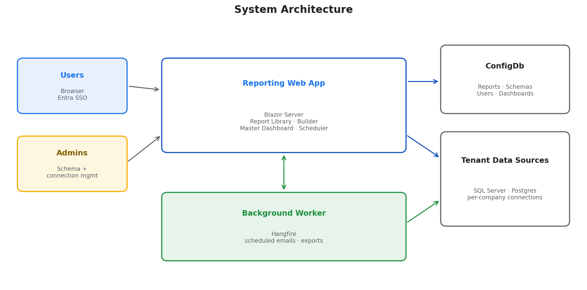
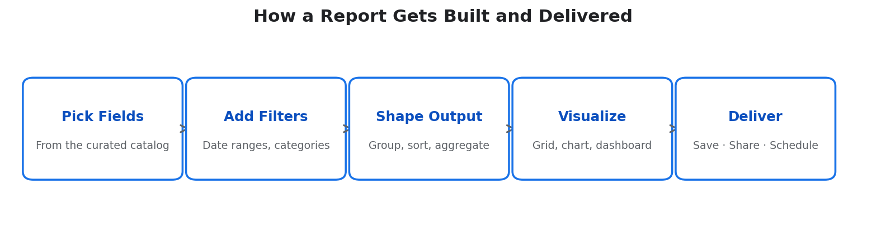
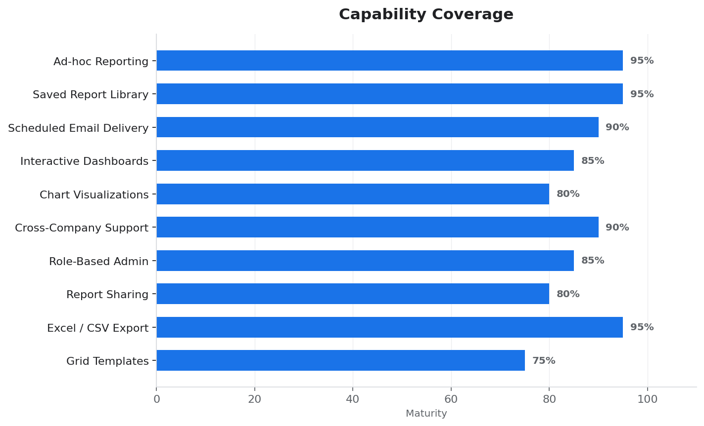
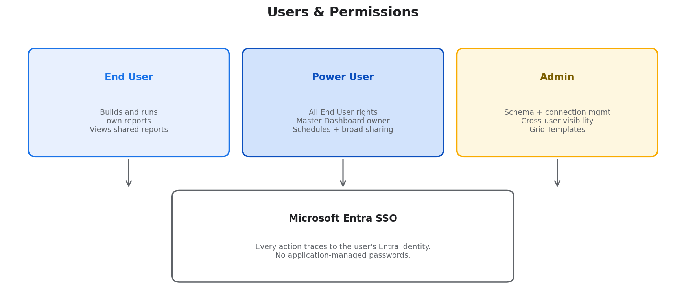
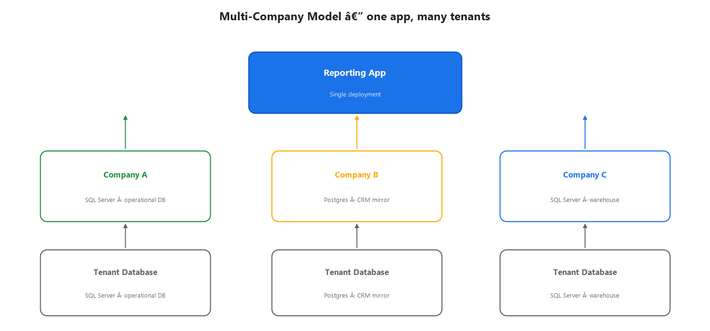

# Contents

- [At a glance](#at-a-glance)
- [What users can do](#what-users-can-do)
- [Capability summary](#capability-summary)
- [Users and permissions](#users-and-permissions)
- [Multi-company architecture](#multi-company-architecture)
- [Platform strengths](#platform-strengths)
- [Where we're investing next](#where-were-investing-next)

\newpage

# At a glance

The **Executive Reporting Suite** is a self-service reporting platform that turns raw business data into reports, dashboards, and scheduled email deliveries — with minimal engineering involvement.

Users log in with their corporate Microsoft account and:

- **Build reports** against live data without writing SQL.
- **Visualize** results as interactive grids, charts, and summary dashboards.
- **Share** saved reports with teammates or entire groups.
- **Schedule** automated email delivery on any cadence.
- **Export** to Excel or CSV in one click.

Administrators configure the data sources, control who sees what, and curate the list of fields users can pick from. The same platform serves **multiple companies** from a single deployment — each tenant has its own databases, its own user directory, and its own report library, all isolated by design.

\newpage

# What users can do

Every user starts in the **Report Library** — a searchable list of reports they own or have had shared with them. From there, any report can be opened, edited, run, scheduled, or exported.

The Report Builder lets users pick from a curated catalog of business fields, apply filters (date ranges, categorical selections, free-form text), group and sort, and view the output as a grid, chart, or summary dashboard. No SQL knowledge required — the platform generates the underlying query safely and efficiently.

**Delivery options** beyond viewing in the browser:

- **Master Dashboard** — a personal landing page where power users pin the reports they watch most frequently, shown as tiles with live data.
- **Scheduled email** — any report can be sent on a recurring cadence to one or more recipients, with the data embedded in the email and attached as Excel or CSV.
- **Share** — grant another user (or an Entra security group) view or edit access, without copying the report.

\newpage

# Capability summary

The platform is mature in its core capabilities (ad-hoc reporting, exports, library management) and continues to invest in features that reduce admin friction — things like grid templates (reusable report skeletons) and starter reports (curated primary tables for non-technical users).

\newpage

# Users and permissions

Access is governed by three tiers, each inheriting the capabilities of the tier below.

- **End users** build their own reports, see reports shared with them, and export/schedule their own work.
- **Power users** get a personal Master Dashboard, can pin reports across companies they have access to, and can schedule or share broadly.
- **Administrators** configure data-source connections, curate the field catalog for each tenant, and have visibility into every report in the system for auditing and support.

**Authentication is fully delegated to Microsoft Entra (Azure AD).** There are no passwords to manage inside the application. Every action — from saving a report to sending an email — traces back to the user's corporate identity, making audit and access reviews straightforward.

\newpage

# Multi-company architecture

A single deployment of the platform can serve multiple tenant companies, each with their own databases and their own field catalogs. Users see only the companies they're assigned to; data never crosses company boundaries inside a query.

Practical implications:

- **Onboard a new tenant without a new deployment.** An administrator adds a company, wires in its database connection, defines the field catalog, and the platform is live for that tenant.
- **Mix database engines freely.** Some companies run on SQL Server, others on Postgres; the same reporting features work against either.
- **Per-company branding and preferences.** Each tenant can have its own dashboard title, logo, time zone, and default page sizes — controlled by that tenant's administrator.

\newpage

# Platform strengths

- **Self-service, by design.** Business users don't need to file a ticket to get a new report. The admin-curated field catalog acts as guardrails, while the builder feels like a spreadsheet pivot table.
- **Safe by construction.** Every query the platform emits is parameterized and validated against the curated schema; users cannot inject raw SQL. Row-level data access is governed by the tenant's own database permissions.
- **Audit-ready.** Every schema change is versioned. Every report has an owner, a created-by, and a full edit history. Every scheduled email logs its recipients and send status.
- **Low operational overhead.** The platform runs as a single web app plus a background worker; no client install, no report server farm. Adding a tenant is a configuration change, not a code change.
- **Extensible without code.** New fields, joins, lookups, custom filters, and even entire data sources are added through the administrator UI — no redeployment required.

\newpage

# Where we're investing next

**Reducing admin ceremony.** The platform originally required hand-editing a JSON schema file for every new field. Today an administrator can point-and-click to add fields, preview queries, and save straight from the browser. Continued work focuses on making this experience usable by non-engineers — named "primary tables" with business labels, starter report templates, and contextual help throughout.

**Better cross-team collaboration.** Sharing today is per-report. Next up: report folders, subscription lists that any manager can manage, and a lightweight approval flow for reports that are promoted to the company-wide dashboard.

**Deeper dashboarding.** The Master Dashboard today shows static tiles. The roadmap includes drill-down from a summary tile into the underlying detail view, live-refresh for pinned tiles, and a dashboard-builder that lets non-admins assemble their own curated views.

---

*Prepared for executive review — April 2026. Questions or deeper walkthroughs available on request from Engineering.*
